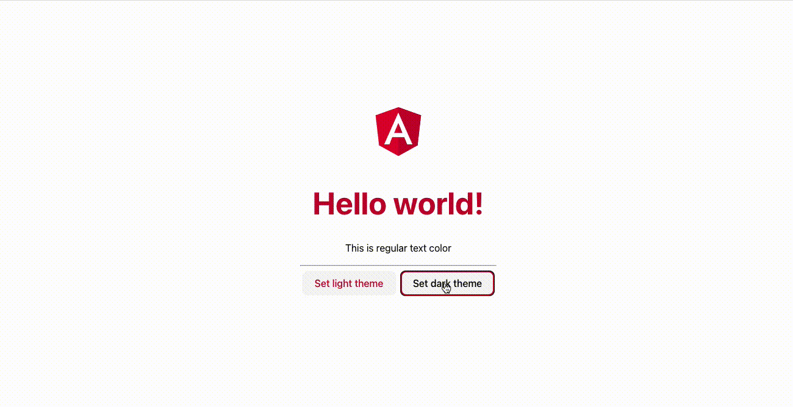

# @quak.lib/Qtheme example - Angular

## Requirements
Vite (build tool) requires Node.js version 14.18+, 16+.

## Overview

*Example Showcase*


This project is made as an example of `@quak.lib/Qtheme` library.

## How to Qtheme with Angular?
Qtheme works with any framework and JS/Typescript with HTML as well.

### Init this project or init separate one with angular CLI
```bash
git clone https://github.com/Walikuperek/Qtheme-examples.git
cd qtheme-examples/angular
npm install
ng serve --open # will open localhost:4200 in browser
```

### Init
Create project, follow prompts
```bash
ng new your-angular-project
```
Enter project directory
```bash
cd your-angular-project
```

### Install Qtheme
```bash
npm install @quak.lib/qtheme
```

### Run project
```bash
ng serve --open
```

### Create theme
```typescript
import {Qtheme, Theme} from '@quak.lib/qtheme'

const darkTheme: Theme = {
  name: 'dark',
  atoms: [
      ['primary', 'dodgerblue'],
      
      ['bg-color', 'background-color:hsl(0, 100%, 0%)'],
      ['text-color', 'color:#fff'],
      ['text-primary', 'color:var(--primary)']
  ] 
}
```

### Init theme
```typescript
const savedTheme: Theme | null = Qtheme.getTheme()

if (savedTheme) {
  Qtheme.setTheme(savedTheme)
} else {
  // Set default theme
  Qtheme.setTheme(darkTheme)
}
```

### Change theme
```typescript
Qtheme.setTheme(lightTeme)
```

### Use theme
```html
<h1 class="text-primary">Hello world!</h1>
<p class="text-color">This is regular text color</p>

<!-- or -->
<button (click)="setLightTheme()" [ngClass]="{'text-primary': !isDarkMode}" class="text-color">Set light theme</button>
<button (click)="setDarkTheme()" [ngClass]="{'text-primary': isDarkMode}" class="text-color">Set dark theme</button>
```
