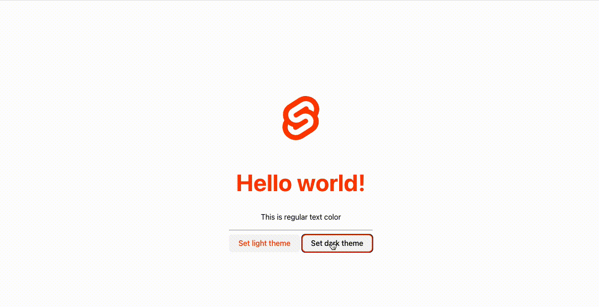

# @quak.lib/Qtheme example - Svelte

## Requirements
Vite (build tool) requires Node.js version 14.18+, 16+.

## Overview

*Example Showcase*


This project is made as an example of `@quak.lib/Qtheme` library.

## How to Qtheme with Svelte?
Qtheme works with any framework and Typescript with HTML as well.

# Init vite
Create project, follow prompts and choose `Svelte` template.
```bash
npm create vite@latest
```
Enter project directory and install dependencies.
```bash
cd your-vite-project
npm install
```

# Install Qtheme
```bash
npm install @quak.lib/qtheme
```

# Run project
```bash
npm run dev
```

# Create theme
```typescript
import {Qtheme, Theme} from '@quak.lib/qtheme'

const darkTheme: Theme = {
  name: 'dark',
  atoms: [
      ['primary', 'dodgerblue'],
      
      ['bg-color', 'background-color:hsl(0, 100%, 0%)'],
      ['text-color', 'color:#fff'],
      ['text-primary', 'color:var(--primary)']
  ] 
}
```

# Init theme
```typescript
const savedTheme: Theme | null = Qtheme.getTheme()

if (savedTheme) {
  Qtheme.setTheme(savedTheme)
} else {
  // Set default theme
  Qtheme.setTheme(darkTheme)
}
```

# Change theme
```typescript
Qtheme.setTheme(lightTeme)
```

# Use theme
```html
<h1 class="text-primary">Hello world!</h1>
<p class="text-color">This is regular text color</p>

<!-- or -->
<button on:click={setDarkTheme} class:text-primary={isDarkTheme}  class="text-color">Set dark theme</button>
```