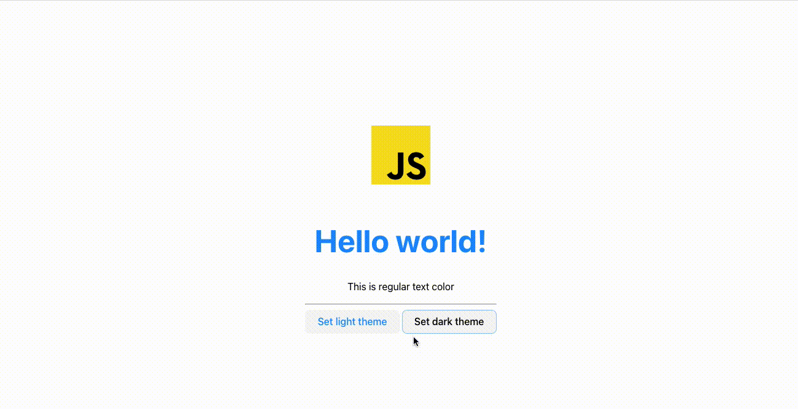

# @quak.lib/Qtheme example - Javascript + HTML

## Requirements
Vite (build tool) requires Node.js version 14.18+, 16+.

## Overview

*Example Showcase*


This project is made as an example of `@quak.lib/Qtheme` library.

## How to Qtheme with Vanilla JS + HTML?
Qtheme works with any framework and plain JS with HTML as well.

# Init vite
```bash
npm create vite@latest
cd your-vite-project
npm install
```

# Install Qtheme & dependencies
```bash
npm install @quak.lib/qtheme
```

# Run project
```bash
npm run dev
```

# Create theme
```typescript
import {Qtheme, Theme} from '@quak.lib/qtheme'

const darkTheme: Theme = {
  name: 'dark',
  atoms: [
      ['bg-color', 'background-color:hsl(0, 100%, 0%)'],
      ['text-color', 'color:#fff'],
      ['primary', 'dodgerblue'],
  ] 
}
```

# Init theme
```typescript
const savedTheme: Theme | null = Qtheme.getTheme()

if (savedTheme) {
  Qtheme.setTheme(savedTheme)
} else {
  // Set default theme
  Qtheme.setTheme(darkTheme)
}
```

# Change theme
```typescript
Qtheme.setTheme(lightTeme)
```
